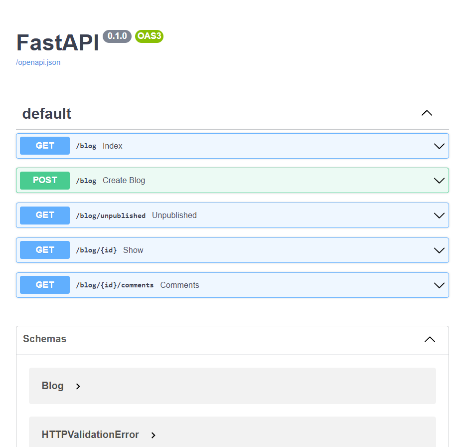
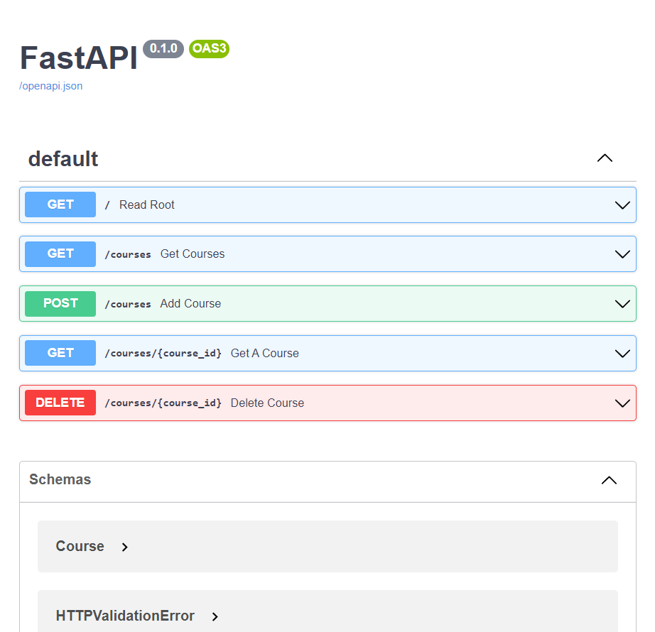

# FastAPI
It is a python framework used to build API's.
The nice thing about the FastAPI is that it supports asynchronous functionality and the framework itself is asynchronous, so as a result it offers more high performance than a typical web framework django and flask.
And in this we don't have to write too much of code because by using python type hint system, FastAPI is able to figure out a lot of things and write the code directly.
And you can easily convert the data from one form to another.

<!-- ABOUT THE PROJECT -->
## About The Project

### Built With

* [Python](https://www.python.org/)
  
* [FastAPI](https://fastapi.tiangolo.com/)

